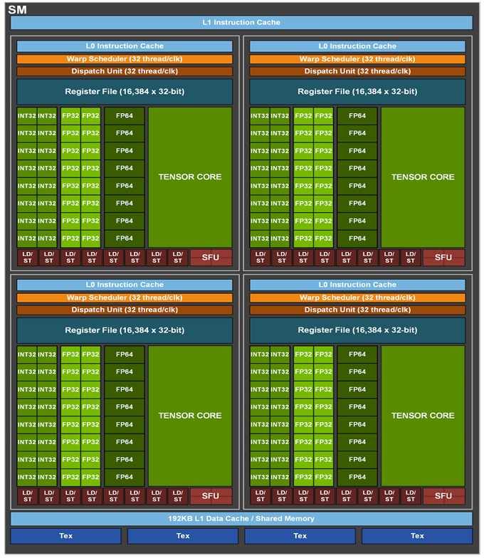
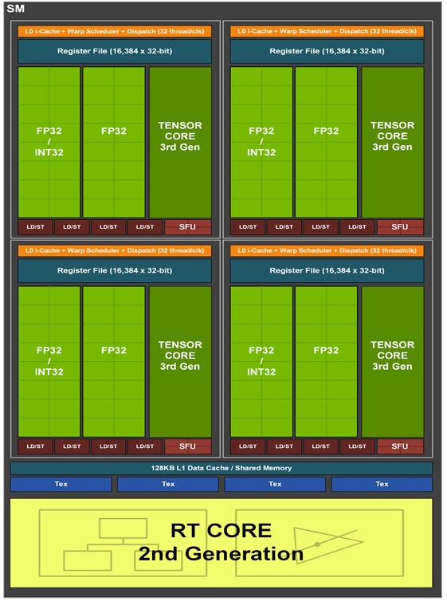

# Introduction

# Educational Resources
## CUDA Programming Guide
The CUDA Documentation contains best practices and a programming guide that establishs many of the patterns that result in optimal CUDA performance. This is a critical reference and daily resource for any level of developer.

[CUDA Documentation](https://docs.nvidia.com/cuda/)

[CUDA Programming Guide](https://docs.nvidia.com/cuda/cuda-c-programming-guide/index.html)


## NVIDIA On Demand
NVIDIA On Demand is a great resource for video format learning.
This contains recordings of all past GTC (GPU Technology Conference) talks, covering topics from begginers to the most advanced.  

[NVIDIA On Demand](https://www.nvidia.com/en-us/on-demand/)

### Suggested Talks

## NVIDIA Blogs
NVIDIA Blogs is the written format equivilant of our GTC talks. most blogs focus on a single technical topic and provide a detailed tutorial, write-up, or demonstration of the given technology. Simiarly to the GTC talks, topics can range from deeply technincal to introductory, on topics from CUDA to precise applications in their scientific field.

[NVIDIA Blog Front page](https://developer.nvidia.com/blog/)

### Suggested Blogs
- [Asychronous CUDA Memory](https://developer.nvidia.com/blog/using-cuda-stream-ordered-memory-allocator-part-1/)

## Architecture White Papers
An Architecture white paper is released with every new GPU architecture, and is the "ground truth" for HW changes and it's associated capability changes. 

- [Blackwell White Paper](https://resources.nvidia.com/en-us-blackwell-architecture)
- [Hopper White Paper](https://resources.nvidia.com/en-us-tensor-core/gtc22-whitepaper-hopper)
- [Ampere 102 White Paper](https://www.nvidia.com/content/PDF/nvidia-ampere-ga-102-gpu-architecture-whitepaper-v2.pdf)
- [Ampere 100 White Paper](https://images.nvidia.com/aem-dam/en-zz/Solutions/data-center/nvidia-ampere-architecture-whitepaper.pdf)
# Accelerate Computing Basics & Goals

## What is Accelerated Computing
## When is my program a candidate for acceleration

# GPU HW Overview
## Types of HW 
comparison of HW diagrams from whitepapers
### Compute HW Resources
| GA100                                |                                 GA102   |
| --------                             |                                 ------- |
|   |      |

[Ampere Compute Capability Core Description](https://docs.nvidia.com/cuda/cuda-c-programming-guide/index.html#compute-capability-8-x)
- CUDA Cores 
- Tensor Cores
- Raytracing Cores
- Special Function Unit
### Memory HW Resources

- HW Memory Types and Hierarchy
  
  [Technical Blog on Memory](https://developer.nvidia.com/blog/cuda-refresher-cuda-programming-model/)
  - Global(Device) Memory
  - L1/L2 Cache
  - Shared Memory
  - Registers
    
- Specialty Memory Types
  
  [CUDA Documentation on Memory Accesses](https://docs.nvidia.com/cuda/cuda-c-programming-guide/index.html#device-memory-accesses)
  - Constant Memory
  - Textures
  - Local Memory

- Memory Alignment and Optimization

  [CUDA Documentation on Memory Alignment](https://docs.nvidia.com/cuda/cuda-c-programming-guide/index.html#device-memory-accesses)


### Operation Specific Dedicated HW
- Copy Engines
- Codecs

## CUDA work breakdown to HW
[HOW GPU COMPUTING WORKS Stephen Jones, GTC 2021: 64-66](https://www.nvidia.com/en-us/on-demand/session/gtcspring21-s31151/)
## Balancing HW to Maximize Performance
[HOW CUDA PROGRAMMING WORKS Stephen Jones, GTC 2022: 49-84](https://www.nvidia.com/en-us/on-demand/session/gtcfall22-a41101/)
## Generational Changes in GPU HW
Compute Capabilites Doc: https://docs.nvidia.com/cuda/cuda-c-programming-guide/index.html#compute-capabilities


# Key Performance Drivers and Bottlenecks
## Speed of Light
NVIDIA Concept of "How fast can something possibly be done". Said another way, "what is the absolute limit of performance for a given problem on a given device".

Very useful to use SoL as a metric to understand your current solution. To calcualte SoL, you need to understand the ype of compute you have, the type and size of data it requries, and the relatiosnhip of the data and compute relative to each data. This, combined with the possible FLOPS/bandwidth of a system can establish a possible SoL for a given problem. This SoL can then be used as a metric for your own solutions. 

Often we use CUB or other highly optimized CUDA libraries as a default "SoL", however in many cases those may still be some percent off true SoL.

## Memory Bound vs Compute Bound
Fundimentally defines: is my performance limited by the speed of my memory, or the speed of my processor? 
- Compute Bound 
  
  When the compute HW can not compute results for a given set of memory faster than the memory can retrieve new memory

- Memory Bound:

  When the Memory bandwidth cannot provide new memory input within the time it takes for compute to complete a computation for a given segment of memory
  
  
### Example Calcuation FP32 10x10 convolution kernel

```
4096*4096 image with a 10x10 kernel 
H100
51200 GFLOPS FP32
2.04TB/s

each pixel requires 100multiples + 99 adds, 199 opers per pixel 

16.77M pixels in image

3.355 GFLOP per image

GPU can do 51,200 GFLOPS/s

GPU can process 15,250 images per second

each images is 16.77M FP32 numbers (4 Bytes) 
67MB per image

need 1.023 TB/s of bandwidth (< 2TB/s HW can do)

Compute Limited!

```

### Example Calcuation 5x5 convolution kernel FFT

```
4096*4096 image with a 5x5 kernel 
H100
51,200 GFLOPS FP32
2.04TB/s

each pixel requires 25 multiples + 24 adds, 49 opers per pixel 

16.77M pixels in image

0.822 GFLOP per image

GPU can do 51200 GFLOPS/s

GPU can process 62,287 images per second

each images is 16.77M FP32 numbers (4 Bytes) 
67MB per image

need 4.18 TB/s of bandwidth (>2TB/s HW can do)

Bandwidth Limited!
```

This example is very "macroscopic" and real-world performance is further limited by global memory latencies, efficiency of workbreakdown, or other factors of the GPU execution. This is still a useful baseline for understanding the performance limiters we can expect in the real kernel, as we will see scaled down versions of these bottlenecks in practice. 

## Latency vs Throughput
[HOW GPU COMPUTING WORKS Stephen Jones, GTC 2021: 41-55](https://www.nvidia.com/en-us/on-demand/session/gtcspring21-s31151/)

## GPU Occupancy
[How To Write A CUDA Program:THE NINJA EDITION Stephen Jones, NVIDIA | GTC 2024 : 12-28](https://www.nvidia.com/en-us/on-demand/session/gtc24-s62401/)


# Techniques for Accelerating Code
## Optimizing Data Allocations 
- Creating Plans and Data allocations ahead of time
## Optimizing Data Movement
- Pinned vs UnPinned copies
- Impact of Types of CUDA Memory

## CUDA Streams 
  - [Streams Blog](https://developer.nvidia.com/blog/gpu-pro-tip-cuda-7-streams-simplify-concurrency/)
  - [Stream Docs](https://docs.nvidia.com/cuda/cuda-c-programming-guide/index.html#streams)

## CUDA Graphs
  - [Graphs Blog](https://developer.nvidia.com/blog/cuda-graphs/)
  - [Graphs Docs](https://docs.nvidia.com/cuda/cuda-c-programming-guide/index.html#cuda-graphs)
  
## Kernel Stalls 
Kernel stalls are the distinct, instruction-level impact of memory, compute, or other resource contention that slows down a kernel. By evaluating (and eliminating) kernel stalls, we can further accelerlate a well-designed kernel.


  **disclaimer: This level of analysis should only be conducted once you have refined a good kernel-level solution. If you have poorly thought-out or optimized data accesss or algorithmic patterns, optimizing at the instruction level will result in mediocre speedups on a poor design. This level of optimization cannot fundimentally correct those higher level issues.**
  
  
### types of stalls
  [Table of Stalls from NCU Documentation](https://docs.nvidia.com/nsight-compute/ProfilingGuide/index.html#id31)
### Most common stalls
- Short/Long Scoreboard Stall
- Stall MIO  Throttle
- Stall Math Throttle
- Stall Wait / not selected

## Kernel Expensive Operations
- Atomics
- Trig
- Syncrhonization 


# CUDA Profiling Tools Overview
## Nsight Systems
### Interpretation Guidance
## Nsight Compute 
### Interpretation Guidance
## ~~Nsight Graphics~~
### ~~Interpretation Guidance~~
## Profiling & Optimizing CUDA Math Libraries
## CUTLASS
## Suggested use patterns and scripting

